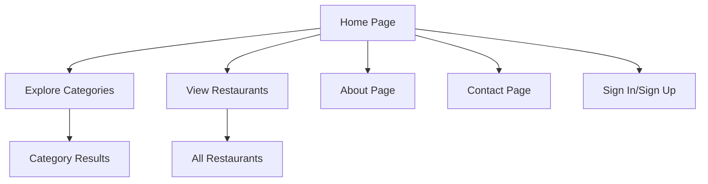

## 1. Product Overview
Night Crawlers is a food delivery platform that connects users with local restaurants and vendors, providing convenient doorstep delivery services. The platform aims to reinvent how people discover, enjoy, and experience food by offering a seamless ordering experience.

Target users include individuals and families seeking convenient food delivery options from local restaurants and vendors.

## 2. Core Features

### 2.1 User Roles
| Role | Registration Method | Core Permissions |
|------|---------------------|------------------|
| Guest User | No registration required | Browse restaurants, view menus, limited access |
| Registered User | Email registration required | Full ordering capabilities, order history, saved addresses |
| Vendor Partner | Admin approval required | Manage restaurant profile, menu items, orders |
| Admin | Internal system access | Platform management, user/vendor oversight |

### 2.2 Feature Module
The Night Crawlers home page consists of the following main components:
1. **Home page**: Navigation header, hero section, vendor showcase, features section, promotional banner, newsletter signup, footer

### 2.3 Page Details
| Page Name | Module Name | Feature description |
|-----------|-------------|---------------------|
| Home page | Top Navigation | Display brand logo, navigation links (Home, Contact Us, Vendors, FAQs), user account icons |
| Home page | Hero Section | Show main headline "Every Delivery to your Doorstep", descriptive text, primary CTA "Explore Categories here", secondary CTA "About Night Crawlers" |
| Home page | Vendor Showcase | Display partner restaurants in circular grid format (KFC, Chicken Republic, Dominos Pizza, Kilimanjaro, Haansa), "Explore all Restaurants" link |
| Home page | Features Section | Three-column layout showcasing "Easy to Order", "Fast Delivery", "Best Quality" with descriptive text and icons |
| Home page | Promotional Banner | Red curved banner with promotional message "We only offer the best service in town!" and supporting text |
| Home page | Newsletter Section | Email subscription form with "Exclusive Menus & Promotions" messaging and delivery person imagery |
| Home page | Footer | Company information, product links, support links, social media icons, copyright notice |

## 3. Core Process
**User Flow:**
1. User lands on homepage and views hero section with main value proposition
2. User can explore featured restaurants in vendor showcase section
3. User learns about platform features (easy ordering, fast delivery, quality)
4. User can subscribe to newsletter for promotions
5. User can navigate to other pages via header/footer links

## 4. User Interface Design

### 4.1 Design Style
- **Primary Color**: Red (#DC2626) for brand elements, CTAs, and accents
- **Secondary Color**: Dark gray/black for text, white for backgrounds
- **Button Style**: Pill/rounded buttons with red background and white text for primary actions
- **Font**: Serif script for brand logo, sans-serif for body text
- **Layout Style**: Card-based sections with circular vendor logos
- **Icon Style**: Circular red icons with white glyphs for navigation

### 4.2 Page Design Overview
| Page Name | Module Name | UI Elements |
|-----------|-------------|-------------|
| Home page | Hero Section | Centered layout, bold dark heading, light gray paragraph text, two rounded CTA buttons (red primary, gray outline secondary) |
| Home page | Vendor Showcase | Grid of circular vendor logos with captions, left-aligned section header, right-aligned "Explore all" link |
| Home page | Features Section | Three-column card layout, circular icons above feature titles, consistent spacing and typography |
| Home page | Newsletter | Left-aligned content with email input field, red subscribe button, delivery person image on right |
| Home page | Footer | Dark background, three-column link structure, red brand logo, social media icons, copyright text |

### 4.3 Responsiveness
- Desktop-first design approach
- Mobile-adaptive layout with responsive breakpoints
- Touch-optimized interactions for mobile devices
- Flexible grid system for vendor showcase section

### 4.4 Accessibility
- Semantic HTML structure for screen readers
- Keyboard navigation support for all interactive elements
- Proper color contrast ratios for text readability
- Alt text for all