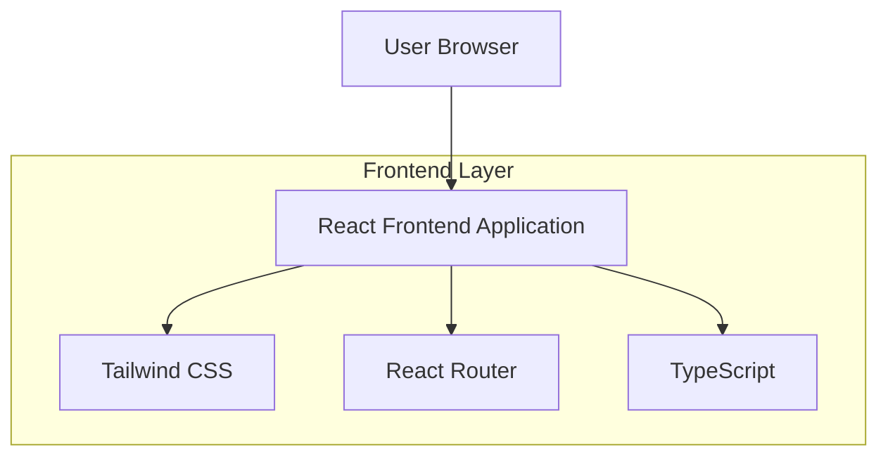

## 1. Architecture Design



## 2. Technology Description
- Frontend: React@18 + TypeScript@5 + Tailwind CSS@3 + Vite
- Initialization Tool: vite-init
- Backend: None (Frontend-only application)
- Styling: Tailwind CSS with custom configuration
- Routing: React Router DOM@6
- Icons: Lucide React or Heroicons

## 3. Route Definitions
| Route | Purpose |
|-------|---------|
| / | Home page, displays main landing page with hero, vendors, features |
| /signin | Login page, allows users to authenticate |
| /signup | Registration page, allows new users to create account |
| /contact | Contact page, provides contact information and form |
| /vendors | Vendors page, displays all partner restaurants |
| /about | About page, company information and mission |

## 4. Component Architecture

### 4.1 Core Components
```typescript
// Navigation Component
interface NavigationProps {
  currentPage?: string;
}

// Hero Section Component
interface HeroProps {
  title: string;
  subtitle: string;
  primaryCTA: CTAButton;
  secondaryCTA: CTAButton;
}

interface CTAButton {
  text: string;
  link: string;
  variant: 'primary' | 'secondary';
}

// Vendor Card Component
interface VendorCardProps {
  name: string;
  logo: string;
  altText: string;
}

// Feature Card Component
interface FeatureCardProps {
  title: string;
  description: string;
  icon: React.ReactNode;
}

// Newsletter Component
interface NewsletterProps {
  title: string;
  description: string;
  placeholder: string;
  buttonText: string;
}
```

### 4.2 Page Components Structure
```
src/
├── components/
│   ├── layout/
│   │   ├── Header.tsx
│   │   ├── Footer.tsx
│   │   └── Navigation.tsx
│   ├── home/
│   │   ├── HeroSection.tsx
│   │   ├── VendorShowcase.tsx
│   │   ├── FeaturesSection.tsx
│   │   ├── PromotionalBanner.tsx
│   │   └── NewsletterSection.tsx
│   └── ui/
│       ├── Button.tsx
│       ├── Card.tsx
│       └── Input.tsx
├── pages/
│   ├── Home.tsx
│   ├── SignIn.tsx
│   ├── SignUp.tsx
│   ├── Contact.tsx
│   ├── Vendors.tsx
│   └── About.tsx
├── styles/
│   └── globals.css
└── utils/
    └── constants.ts
```

## 5. Responsive Design System

### 5.1 Breakpoints
- Mobile: 640px and below
- Tablet: 641px - 1024px
- Desktop: 1025px and above

### 5.2 Grid System
- Vendor showcase: 2 columns mobile, 3 columns tablet, 5 columns desktop
- Features section: 1 column mobile, 3 columns desktop
- Footer: 1 column mobile, 4 columns desktop

## 6. Asset Management

### 6.1 Image Requirements
- Vendor logos: Circular format, 200x200px minimum
- Hero images: High resolution, optimized for web
- Icons: SVG format for scalability

### 6.2 Color Palette
```css
:root {
  --primary-red: #DC2626;
  --primary-red-dark: #B91C1C;
  --text-dark: #1F2937;
  --text-gray: #6B7280;
  --background-white: #FFFFFF;
  --background-light: #F9FAFB;
}
```

## 7. Performance Optimization

### 7.1 Image Optimization
- Use next-gen formats (WebP, AVIF)
- Implement lazy loading for images below fold
- Responsive images with srcset

### 7.2 Code Splitting
- Route-based code splitting with React.lazy
- Component-level splitting for heavy components
- Vendor library optimization

## 8. Accessibility Implementation

### 8.1 ARIA Labels
- Navigation landmarks for screen readers
- Descriptive alt text for all images
- Proper heading hierarchy (h1-h6)

### 8.2 Keyboard Navigation
- Tab order optimization
- Focus management for interactive elements
- Skip navigation links

### 8.3 Color Contrast
- WCAG 2.1 AA compliance minimum
- High contrast mode support
-